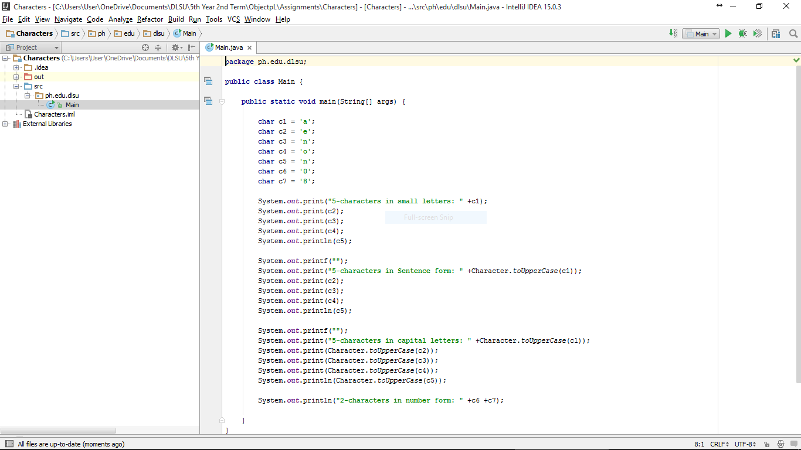
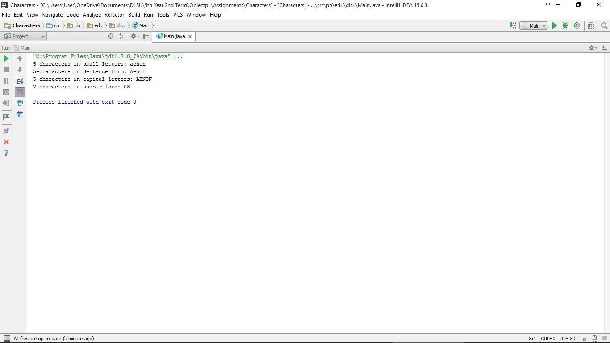

#Characters

Introduction to characters

#ScreenShots



#Code

```
package ph.edu.dlsu;

public class Main {

    public static void main(String[] args) {

        char c1 = 'a';
        char c2 = 'e';
        char c3 = 'n';
        char c4 = 'o';
        char c5 = 'n';
        char c6 = '0';
        char c7 = '8';

        System.out.print("5-characters in small letters: " +c1);
        System.out.print(c2);
        System.out.print(c3);
        System.out.print(c4);
        System.out.println(c5);

        System.out.printf("");
        System.out.print("5-characters in Sentence form: " +Character.toUpperCase(c1));
        System.out.print(c2);
        System.out.print(c3);
        System.out.print(c4);
        System.out.println(c5);

        System.out.printf("");
        System.out.print("5-characters in capital letters: " +Character.toUpperCase(c1));
        System.out.print(Character.toUpperCase(c2));
        System.out.print(Character.toUpperCase(c3));
        System.out.print(Character.toUpperCase(c4));
        System.out.println(Character.toUpperCase(c5));

        System.out.println("2-characters in number form: " +c6 +c7);

    }
}

```
